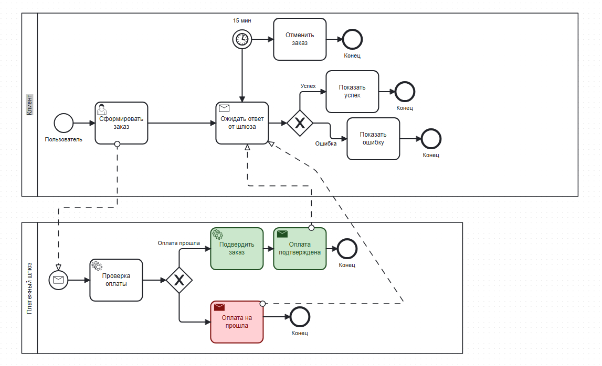
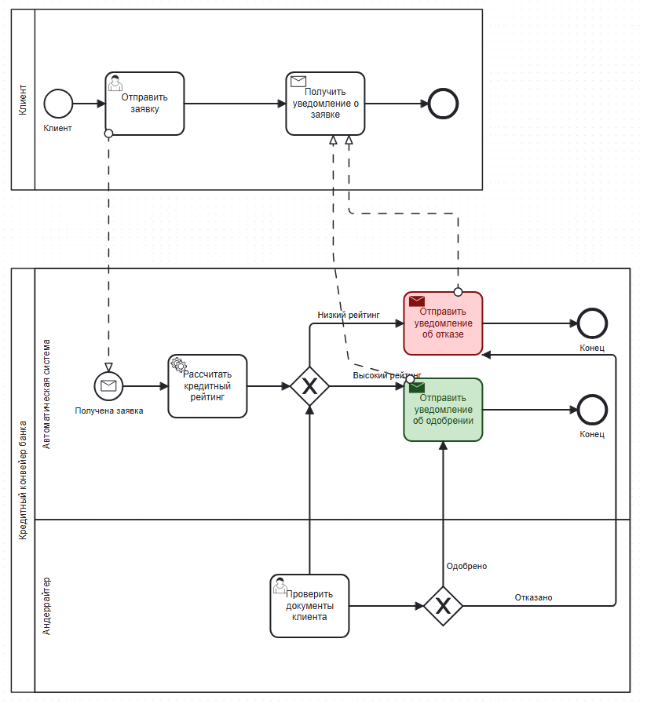

# Business Process Modeling & Analysis

Репозиторий содержит портфолио моделей бизнес-процессов (BPMN 2.0) и артефактов системного анализа для различных доменных областей.

## Стек и инструменты
* **Нотации:** BPMN 2.0
* **Инструменты моделирования:** bpmn.io

## Проекты в репозитории 

### 1. [Система управления библиотекой (Library Management System)](./library-management-system/)
* **Процесс:** Выдача книги читателю.
* **Ключевые фичи:** Разделение зон ответственности (Client/Backend), асинхронное взаимодействие через потоки сообщений, валидация наличия сущностей в БД, обработка негативных сценариев.

### 2. Процесс онлайн-оплаты с таймаутом (Online Payment Process)
* **Процесс:** Обработка транзакции платежным шлюзом и маршрутизация статусов на стороне клиента.
* **Ключевые фичи:** * Использование прерывающего события-таймера (Interrupting Boundary Timer Event) для защиты от зависания процесса (SLA 15 минут).
  * Реализация паттерна Request-Reply при асинхронном взаимодействии систем.
  * Эксклюзивный шлюз (XOR) на клиенте для динамического изменения UI (Показ успеха или ошибки) на основе входящего JSON-ответа.

### 3. Кредитный конвейер банка (Credit Pipeline Process)
* **Процесс:** Автоматизированное рассмотрение заявки на кредитную карту с возможностью ручной верификации (андеррайтинга).
* **Ключевые фичи:** * **Использование дорожек (Swimlanes):** Четкое разделение зон ответственности внутри одного пула между бэкенд-скриптами (`Автоматическая система`) и операционным сотрудником (`Андеррайтер`).
  * **Многопоточное ветвление (Multi-path Routing):** Проектирование эксклюзивного шлюза (XOR) на 3 исхода на основе результатов автоскоринга (авто-одобрение, авто-отказ, пограничный рейтинг).
  * **Паттерн переиспользования сервисов (Service Reuse):** Ручные решения сотрудника закольцованы обратно на системную дорожку. Это позволяет использовать одни и те же микросервисы отправки уведомлений как для автоматических, так и для ручных сценариев.

